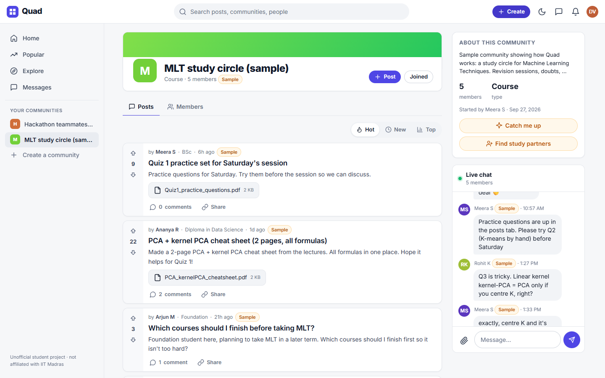
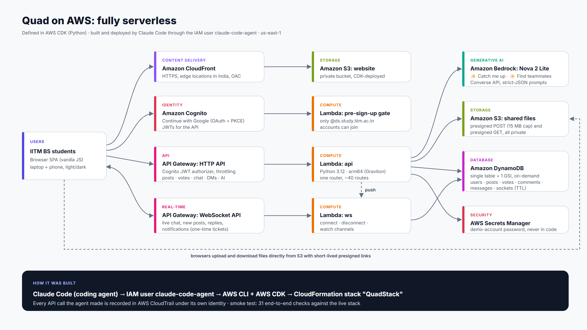

# Quad: the campus our online degree doesn't have

**Live:** https://d3sky2k7b1uv30.cloudfront.net (click **Try the live demo**, no sign-up needed)

Quad is a community app that only verified students of the **IIT Madras BS degree** can join. The degree is fully online, with 30,000+ students spread across India.

- **Verified sign-in** with the student's IITM Google account. A Cognito trigger rejects anything outside `@ds.study.iitm.ac.in`. The batch is read from the roll number (`23f2…` → "2023 · Term 2").
- **Reddit-style communities** for courses, exam prep, hackathons, fests, clubs and city meetups. Posts have titles, up/down votes, Hot/New/Top sorting and threaded replies.
- **Live group chat** in every community, docked beside the feed, with file sharing (PDFs and images up to 15 MB).
- **Direct messages**, real-time **notifications**, **search**, and light and dark themes.
- **✨ Catch me up** (Amazon Bedrock): TL;DR, highlights, deadlines, unanswered questions and key files from what you missed.
- **✨ Find teammates / study partners** (Amazon Bedrock): describe what you need and get matching members, each with a reason.



> Unofficial student project, not affiliated with IIT Madras. Built for the AWS Builder Center *Zero to Shipped* hackathon with Claude Code connected to AWS. See [DEVLOG.md](DEVLOG.md).

## Architecture



CloudFront + S3 (site) · Cognito with Google federation and a pre-sign-up Lambda gate · API Gateway HTTP API (JWT authorizer) and WebSocket API · Lambda (Python 3.12, arm64) · DynamoDB single table · S3 presigned uploads · Amazon Bedrock (Nova 2 Lite) · Secrets Manager. All of it is defined in [infra/quad_stack.py](infra/quad_stack.py) (AWS CDK, Python).

| Path | What |
|---|---|
| [backend/api.py](backend/api.py) | HTTP API: profiles, communities, posts, votes, threaded comments, chat, DMs, uploads, notifications, search, demo login |
| [backend/ws.py](backend/ws.py) | WebSocket connect/disconnect/watch, with one-time ticket auth |
| [backend/catchup.py](backend/catchup.py) | ✨ Catch me up (Bedrock Converse, strict-JSON output) |
| [backend/teammates.py](backend/teammates.py) | ✨ Find teammates / study partners (Bedrock) |
| [backend/auth_trigger.py](backend/auth_trigger.py) | Cognito pre-sign-up gate: student accounts only |
| [frontend/](frontend/) | Dependency-free SPA (HTML/CSS/JS), light and dark themes |
| [scripts/smoke_test.py](scripts/smoke_test.py) | 31 end-to-end checks against the live stack; cleans up after itself |
| [scripts/seed.py](scripts/seed.py) | Starter communities, plus clearly-labelled sample content for the demo |
| [scripts/quick_deploy.py](scripts/quick_deploy.py) | Code-only deploy without a CDK synth |
| [scripts/setup_google_login.py](scripts/setup_google_login.py) | Connects Google sign-in (the OAuth secret stays out of the repo) |
| [scripts/agent_proof.py](scripts/agent_proof.py) | Builds [docs/agent-proof.md](docs/agent-proof.md) from CloudTrail: every AWS call the coding agent made |

## Deploy

```bash
python -m venv .venv && .venv/Scripts/pip install aws-cdk-lib constructs boto3 pymupdf requests websocket-client
cd infra
npx aws-cdk@latest bootstrap
npx aws-cdk@latest deploy QuadStack --outputs-file ../cdk-outputs.json
cd .. && .venv/Scripts/python scripts/seed.py
.venv/Scripts/python scripts/smoke_test.py
```

Settings live in [infra/cdk.json](infra/cdk.json): `allowedDomains`, `modelId`, `appUrl`, `authDomain`.
